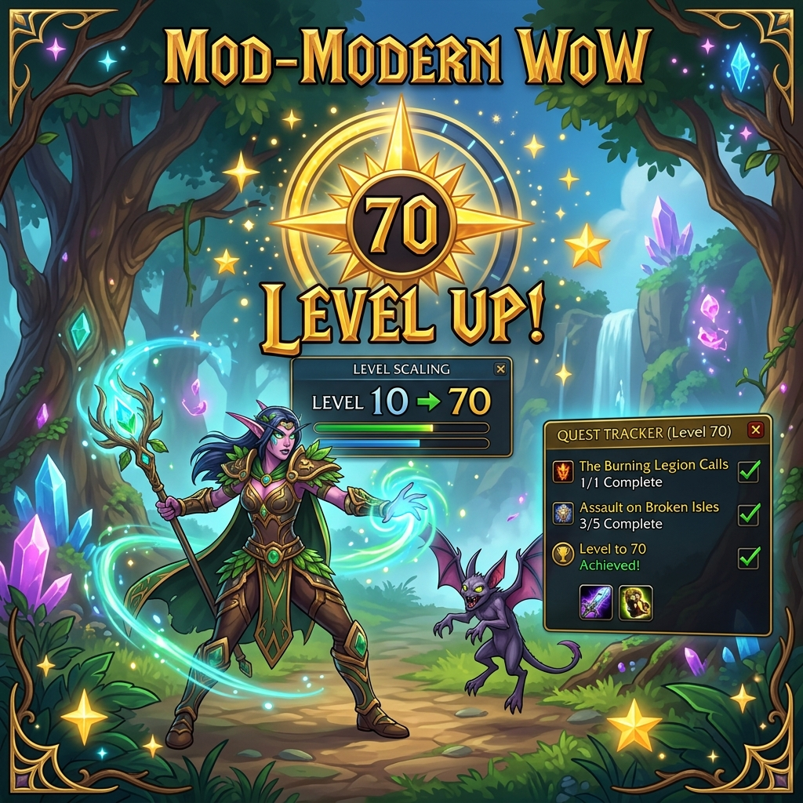
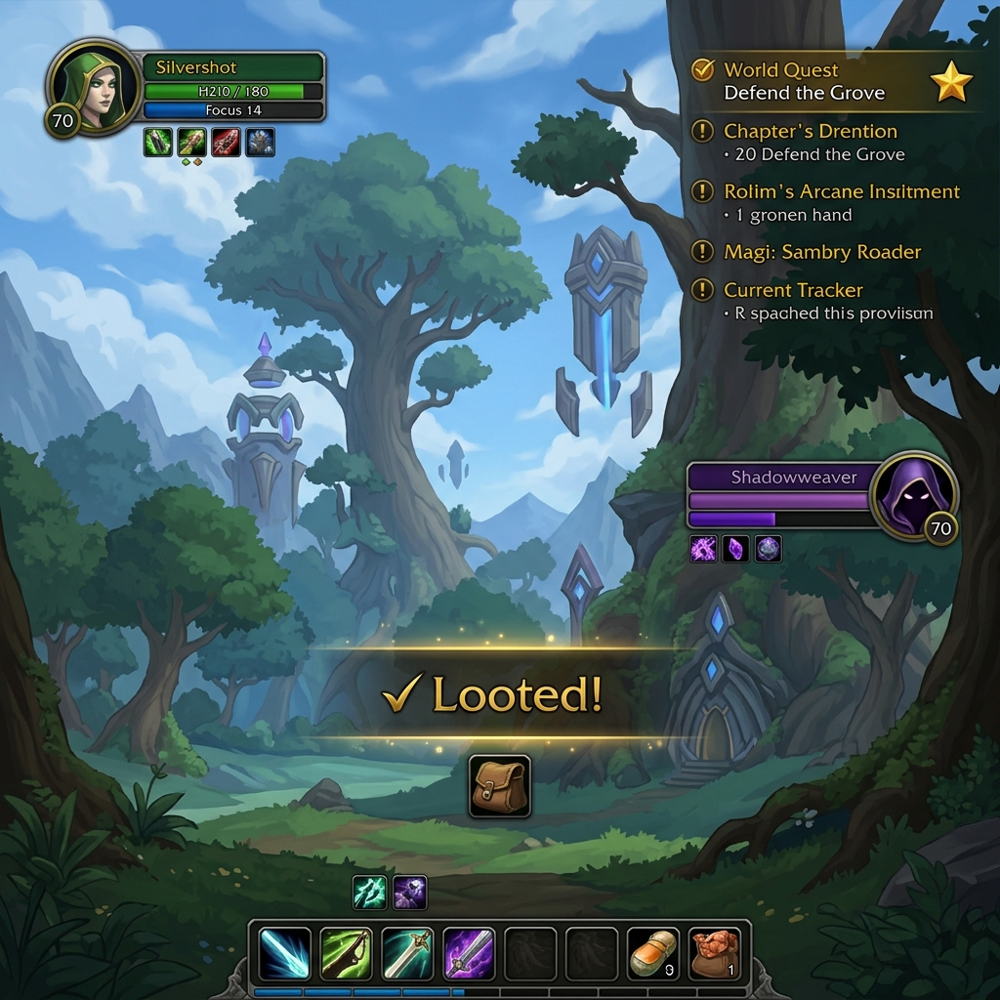
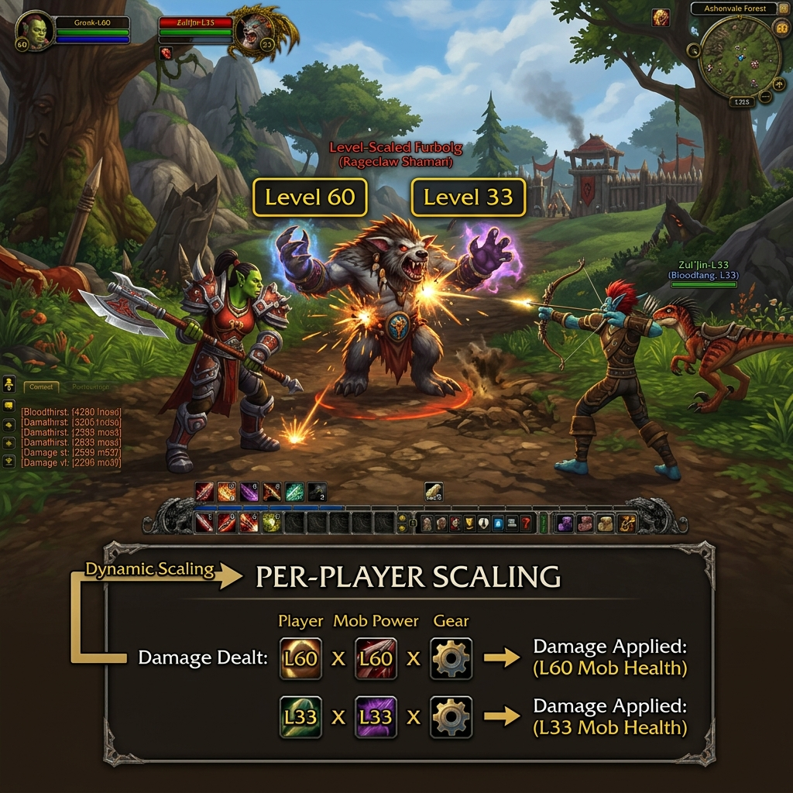
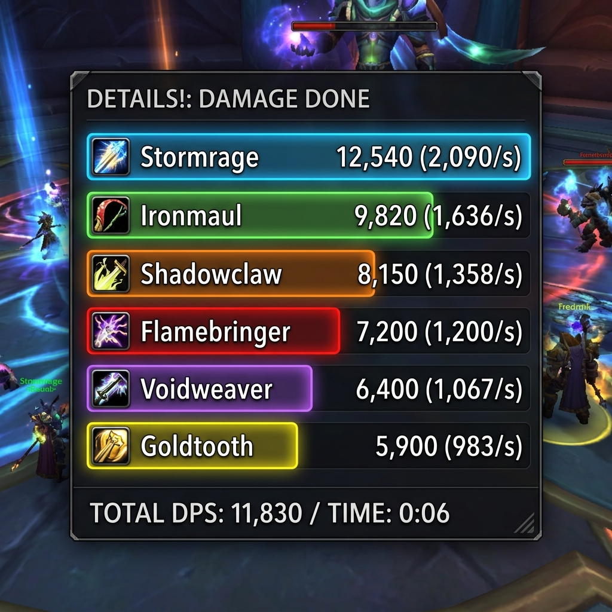
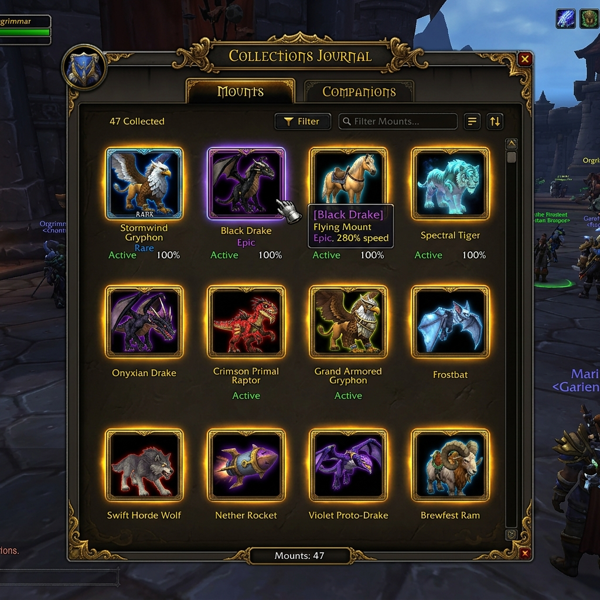

# mod-modernWoW



**AzerothCore module** — Modernizes the WoW 3.3.5 (WotLK) experience to feel closer to current-generation WoW.

## Features

| Feature | Description |
|---------|-------------|
| 🎯 **Auto-Loot** | Automatically picks up all loot on corpse open |
| ⚖️ **Dynamic Creature Scaling** | Creatures scale to player level in all zones |
| 👥 **Personal Loot** | Group members each receive their own loot |
| ⚡ **Spell Queue** | 400ms spell queue window for smooth casting |
| 🌍 **World Quests** | Daily rotating world quests with bonus rewards |
| 🚀 **Catch-Up Mechanic** | Alt characters get XP bonus if account has a lvl 80 |
| ✉️ **Instant Mail** | Zero mail delivery delay |
| 🏰 **Guild Perks** | XP bonus and Cash Flow for guild members |

## Installation

### 1. Server Module

Clone (or copy) into your AzerothCore modules directory:

```bash
cd /path/to/azerothcore-wotlk/modules/
git clone https://github.com/yourname/mod-modernWoW
```

Rebuild AzerothCore:

```bash
cd /path/to/azerothcore-wotlk/build/
cmake .. -DMODULES=static
make -j$(nproc)
```

### 2. Database

Run the SQL files in order:

```bash
# World database
mysql -u root -p acore_world < data/sql/db_world/base/modernwow_world_quests.sql

# Character database
mysql -u root -p acore_characters < data/sql/db_characters/base/modernwow_tables.sql
```

### 3. Configuration

Copy the config file:

```bash
cp conf/mod-modernwow.conf.dist /path/to/worldserver/conf/mod-modernwow.conf
```

Edit `mod-modernwow.conf` to enable/disable features as needed.

### 4. WoW Addon (Client-Side)

Copy the `addon/ModernWoW` folder to your WoW client's `Interface/AddOns/` directory:

```
WoW/Interface/AddOns/ModernWoW/
```

Enable "ModernWoW" in the addon list at the character select screen.



## Configuration

See [`conf/mod-modernwow.conf.dist`](conf/mod-modernwow.conf.dist) for all options.

Key settings:

```ini
ModernWoW.Enable = 1

# Auto-Loot: 0=off, 1=all, 2=threshold
ModernWoW.AutoLoot.Enable = 1

# Dynamic Scaling: all zones
ModernWoW.DynamicScaling.Enable = 1
ModernWoW.DynamicScaling.ExcludeRaids = 1

# Personal Loot: 0=off, 1=all, 2=dungeons only
ModernWoW.PersonalLoot.Enable = 1

# World Quests
ModernWoW.WorldQuests.Enable = 1
ModernWoW.WorldQuests.ActiveCount = 12
```

## GM Commands

| Command | Access | Description |
|---------|--------|-------------|
| `.modernwow info` | Player | Show module status |
| `.modernwow reload` | Admin | Reload config |
| `.modernwow wq list` | Player | List active world quests |
| `.modernwow wq refresh` | Admin | Force world quest refresh |
| `.modernwow catchup [player]` | GM | Check catch-up status |

Short alias: `.mwow` works for all commands.

## World Quest Setup

Add quests to the pool via SQL:

```sql
INSERT INTO `modernwow_worldquest_pool` (quest_id, enabled, min_level, max_level, description)
VALUES
  (13011, 1, 77, 80, 'Icecrown Daily: Shattered Abomination'),
  (13012, 1, 77, 80, 'Icecrown Daily: Assault by Ground');
```

To find eligible daily quests in your database:

```sql
SELECT q.ID, q.LogTitle, q.QuestLevel
FROM quest_template q
WHERE q.Flags & 1024 AND q.QuestLevel >= 70
ORDER BY q.QuestLevel DESC
LIMIT 50;
```

## Addon Commands

| Command | Description |
|---------|-------------|
| `/mwow` or `/modernwow` | Help |
| `/mwow info` | Show feature status |
| `/mwow autoloot` | Toggle auto-loot |
| `/mwow tracker` | Toggle quest tracker |
| `/mwow frames` | Toggle modern unit frames |
| `/mwow meter` | Toggle damage meter |
| `/collections` | Open Collections Journal |

## Screenshots

### Dynamic Per-Player Content Scaling
Two players of different levels see the same creature at their own level — both yellow, both equally challenged.



### Damage Meter
A lightweight built-in combat damage meter with per-player color-coded bars and DPS totals.



### Collections Journal
Browse and manage all your mounts and companions in a modern icon grid window.



### Addon HUD (Unit Frames, Quest Tracker, Auto-Loot)
Class-colored health bars, World Quest tracker with gold stars, and `✓ Looted!` feedback animations.


## Requirements

- [AzerothCore](https://github.com/azerothcore/azerothcore-wotlk) (latest)
- C++17 compiler
- WoW 3.3.5a client (for addon)

## License

GPL v3 — See [LICENSE](LICENSE)
